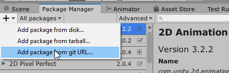

## Table of Contents

* [What is MIKROS?](#what-is-mikros)
* [How Does MIKROS Work?](#how-does-mikros-work)
* [Installation](#installation)
* [How to Implement MIKROS?](#how-to-implement-mikros)
* [SDK Initialization](#sdk-initialization)
* [Privacy Standard](#privacy-standard)
* [Mikros Analytics](#mikros-analytics)
	* [Custom Analytics Events](#mikros-analytics-custom)
* [FAQ](*faq)


<a name="what-is-mikros"></a>
## What Is MIKROS?
MIKROS is a service aimed at game developers which provides useful information and clear analytics in a sharing ecosystem, also known as data pooling. These insights about user behaviour can help developers understand their clientele better including their spending habits. MIKROS uniquely displays its analytics in a simple format with the goal of connecting game developers and advertisers to a full understanding of the problems they are looking to solve. This is due to all the data being in the MIKROS ecosystem.

<a name="how-does-mikros-work"></a>
## How Does MIKROS Work?
MIKROS sorts users by spending and activity levels in its ecosystem. This differs from how data is currently managed by competitors as they do not offer any data pooling. Game developers and advertisers can then view reports in a dashboard with valuable information which is needed to identify areas to improve their customer experience. With MIKROS, advertisers can now be certain that their ads are being shown to verified spenders.

<a name="installation"></a>
## Installation
### Installation via Git in UPM

You can install via Git. This assumes you have Git installed on your
computer.

In later versions of Unity, you can import directly via the Package Manager
interface.



Supply the following URL:

```
https://github.com/TATUMGAMES/TG-MIKROS-SDK-unity-package.git
```

<a name="how-to-implement-mikros"></a>
## How to Implement MIKROS?
1. In order to use Mikros, clients (game developers/publishers) must go to https://developer.tatumgames.com/
2. Select a subscription plan. The options are FREE, STARTUP, ENTERPRISE
3. Register an account, and verify this account via email
4. Once inside the Mikros dashboard, the client can "create app". The process of creating an app is filling out a form that includes details such as company name, game title, description, package name (bundle id), product assets, videos, category {RPG, Puzzle, Platformer, CCG, Strategy, Other}

Once steps 1-4 is completed, the following will be generated:
1. App Game ID (auto-generated)
2. Production API Key (auto-generated)
3. QA API Key (Manual)
4. Development API Key (Manual)

Now, the client has to include the Mikros SDK into their gaming product and setup the SDK by the following method:
1. In the Unity Editor, select **Mikros > Edit Settings**
2. In the Inspector tab of **Mikros Settings**, paste in your App Game ID and API keys that have been generated.
3. *(Optional)* If you want manual initialization of the SDK, disable the ***Auto Initialize At Start*** option from the Mikros Settings. By default, it is kept enabled.
4. *(Optional)* You also have the option to select which API key to use at any development stage. By default, Production API Key is used.
5. *(Optional)* Mikros collects and sends session data for better user insights and is also crucial for Analytics purpose. This can be enabled or disabled by the ***Auto Track User Session*** option from the Mikros Settings. By default, it is kept enabled and is recommended to keep it that way.
6. *(Optional)* Mikros collects and sends metadata for better user insights and is also crucial for Analytics purpose. This can be enabled or disabled by the ***Auto Track User Metadata*** option from the Mikros Settings. By default, it is kept enabled and is recommended to keep it that way.

<a name="sdk-initialization"></a>
### SDK Initialization

Mikros SDK is initialized automatically by default. But you can manually initialize at any point in the following way:

Make sure to have the following namespaces defined at the top of your scripts:
```
using MikrosClient;
```

##### Initialize with Privacy Level set in Mikros Settings
```
MikrosManager.Instance.InitializeMikrosSDK();
```

##### Initialize with custom Privacy Level

| Parameter              | Type                    | Field      |
| ---------------------- | ----------------------- | ---------- |
| privacyLevel           | PRIVACY_LEVEL           | Optional   |
| isEventLogging         | Boolean                 | Required   |

```
Configuration configuration = Configuration.Builder().SetPrivacyLevel(privacyLevel).SetEventLogging(isEventLogging).Create();
MikrosManager.Instance.InitializeMikrosSDK(configuration);
```

*Note: The privacy configuration that is set in MikrosSettings from Editor, will always get overriden whenever a Configuration parameter is passed to the `MikrosManager.Instance.InitializeMikrosSDK` method.*


You can use the `MikrosManager.Instance` and request objects to perform any operation. You will also need to pass in the correct response callbacks.

<a name="privacy-standard"></a>
### Privacy Standard

Mikros provides 3 levels of privacy, all of which are GDPR & CCPA compliant. Following is the description for each privacy level:
1. PRIVACY_LEVEL.DEFAULT
   (Recommended) Mikros tracks user metadata and session in the background.

2. PRIVACY_LEVEL.HIGH
   Mikros no longer tracks any metadata information in the background; only session is tracked.

3. PRIVACY_LEVEL.EXTREME
   Mikros no longer tracks any metadata or session in the background. You will have to track manually.

However, Mikros also provides interfaces to set privacy standards according to requirement. This can be done as follows:

| Parameter              | Type                    | Field      |
| ---------------------- | ----------------------- | ---------- |
| isTrackUserSession     | Boolean                 | Required   |
| isTrackUserMetadata    | Boolean                 | Required   |
| isEventLogging         | Boolean                 | Required   |

```
MikrosManager.Instance.ConfigurationController.SetAutoTrackUserSession(isTrackUserSession);
MikrosManager.Instance.ConfigurationController.SetAutoTrackUserMetadata(isTrackUserMetadata);
MikrosManager.Instance.ConfigurationController.SetEventLogging(isEventLogging);
```

If at any point it is required to customize logging of all type of user activity tracking (preset events, custom events, metadata, session), it can be done as follows:

| Parameter              | Type                    | Field      |
| ---------------------- | ----------------------- | ---------- |
| isAllTrackingEnabled   | Boolean                 | Required   |
```
MikrosManager.Instance.ConfigurationController.SetAllTrackingEnabled(isDisableAllTracking);
```
<a name="mikros-analytics"></a>
### Mikros Analytics
Once the SDK is initialized, you can immediately start logging events (preset or custom) for analytics.

Make sure to have the following namespaces defined at the top of your scripts:
```
using MikrosClient;
using MikrosClient.Analytics;
```

<a name="mikros-analytics-custom"></a>
#### Custom Analytics Events
Custom events can be tracked by the following ways:
1. To log an event without any parameters
```
MikrosManager.Instance.AnalyticsController.LogEvent("custom_event_name", (Hashtable customEventWholeData) =>
{
    // handle success
},
onFailure =>
{
    // handle failure
});
```

2. To log an event with only one parameter of String datatype
```
MikrosManager.Instance.AnalyticsController.LogEvent("custom_event_name", "parameter", "parameter_value", (Hashtable customEventWholeData) =>
{
    // handle success
},
onFailure =>
{
    // handle failure
});
```

3. To log an event with only one parameter of Double datatype
```
MikrosManager.Instance.AnalyticsController.LogEvent("custom_event_name", "parameter", 1.5, (Hashtable customEventWholeData) =>
{
    // handle success
},
onFailure =>
{
    // handle failure
});
```

4. To log an event with only one parameter of Long datatype
```
MikrosManager.Instance.AnalyticsController.LogEvent("custom_event_name", "parameter", 1, (Hashtable customEventWholeData) =>
{
    // handle success
},
onFailure =>
{
    // handle failure
});
```

5. To log an event with multiple parameters of any datatype
```
Hashtable parameterData = new Hashtable();
parameterData.Add("parameter1", "parameter_value");
parameterData.Add("parameter2", 1.5);
parameterData.Add("parameter3", 1);
parameterData.Add("parameter4", true);
MikrosManager.Instance.AnalyticsController.LogEvent("custom_event_name", parameterData, (Hashtable customEventWholeData) =>
{
    // handle success
},
onFailure =>
{
    // handle failure
});
```

All custom events are uploaded automatically to backend at a feasible time whenever the phone is idle. However, these events can also be uploaded any time in the following way:
```
MikrosManager.Instance.AnalyticsController.FlushEvents();
```
